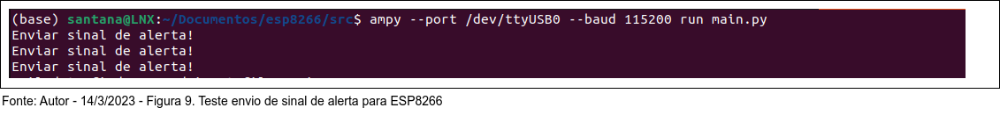

# Explorando o Potencial do ESP8266 ou ESP32 e do MicroPython para o Desenvolvimento de Projetos IoT


>"A Internet das Coisas nos ajuda a conectar o mundo real com o virtual, criando uma grande rede com inúmeras possibilidades". - Stephen Hawking


O aumento da popularidade dos dispositivos baseados em Internet das Coisas (IoT), tem trazido à tona cada vez mais novas aplicações e usos para os usuários. O ESP8266 é um microcontrolador de baixo custo, que permite aos desenvolvedores criar dispositivos conectados à Internet de maneira prática e acessível. O MicroPython, por sua vez, é uma linguagem de programação leve e altamente portátil que suporta o ESP8266. Combinando estes dois componentes, é possível criar facilmente projetos IoT avançados.

Neste artigo, exploraremos o potencial do ESP8266 e do MicroPython para o desenvolvimento de projetos IoT. Vamos nos concentrar em um protótipo simples, de como usar esses componentes para criar um dispositivo IoT. Faremos isso começando com o básico, desde o hardware até o software, e mostraremos como conectar o ESP8266 com o MicroPython para criar um dispositivo IoT. Ao final, você terá uma boa compreensão de como criar seus próprios projetos IoT usando o ESP8266 e o MicroPython.


**Definição do problema**


Pessoa mora sozinha e, frequentemente, esquece de desligar o gás do fogão. Isso pode se tornar perigoso, pois o vazamento de gás pode causar acidentes e até mesmo mortes. Além disso, a fumaça do gás pode causar problemas respiratórios, afetando a saúde da pessoa. Por isso, é importante que seja encontrada uma solução para o problema.


Caso não seja encontrada uma solução urgente para o problema, as principais consequências são:

1. Incêndios e explosões;
2. Envenenamento por gases tóxicos;
3. Lesões graves ou mortes por asfixia;
4. Intoxicação alimentar;
5. Risco de incêndio em áreas vizinhas;
6. Interrupções no fornecimento de energia;
7. Dano à propriedade;
8. Proprietário do imóvel pode ser responsabilizado.


**Definição das Metas**


CTQ significa Critérios de Qualidade. São critérios usados para medir a qualidade dos produtos ou serviços fornecidos por uma empresa. Os critérios de qualidade podem incluir itens como custo, tempo de entrega, desempenho, confiabilidade, segurança e outros fatores que ajudam a determinar se os produtos ou serviços oferecidos satisfazem ou excedem as expectativas dos clientes.


CQT 01 - Percentual de incidentes de vazamento de gás igual a zero;<br>
CQT 02 - Notificação de todos eventos de vazamentos;


**Desenvolvimento de Projetos IoT Usando o ESP8266 e o MicroPython: Prova de Conceito**


Esta prova de conceito visa avaliar se a IoT pode ser usada para detectar e controlar vazamentos de gás de forma eficaz, minimizando o risco de acidentes e prejuízos.


**Diagrama arquitetura**


**Cenário atual**


Ambiente com risco de incêndio, devido falta de equipamentos de controle. Caso ocorra esquecimento do gás aberto, a área está sujeita a altos níveis de monóxido de carbono que podem ser perigosos para a saúde.


**Cenário futuro**


A automação da cozinha é uma ótima maneira de garantir segurança e ajudar a evitar vazamentos, pois ela oferece melhores soluções para a detecção e monitoramento de problemas no funcionamento dos equipamentos que usam gás.

No exemplo ilustrado na figura 2., a solução proposta e implementada foi instalação dos sequintes dispositivos: 

(1) válvula solenoide de controle corte e bloqueio de gás GLP; 

(2) Sensor detector de gás natuaral e GLP;

(3) Dispositivo (IoT) ESP8266 com software embarcado em Python, com a função de monitoramento e envio de mensagens de alertas sempre que um incidente ocorrer.


**Dispositivos e fluxo dos eventos**


**Funcionamento**


O Dispositivo com sensor de gás é instalado na cozinha e próximo ao fogão. Este dispositivo tem um sensor que "sente" a presença de gás no ambiente, devido a vazamento ou valvulas de fogão que ficou aberta, e o sensor envia um sinal para válvula solenoide, instalada no regulador de gás que bloqueia a passagem mediatamente, evitando uma explosão, o sensor também emite sinal sonoro avisado do problema encontrado no ambiente. O sistema só volta a normalidade rearmando o sistema Shut-off que existe na válvula através de um botão vermelho.


**Implantação**


Esta prova de conceito foi implementada em duas fases: Na primeira fase, foi instalada a válvula solenoide no registro do botijão e o sensor de gás próximo ao fogão.


**Recomendações**

Leitura, entendimento e aplicação das Normas Regulamentadoras NR-10 e NR-12, para que possam cumprir com a segurança necessária a instalação dos equipamentos e sensores;

**Consulte a especificação técnica dos sensores fornecida pelo fabricante**

**Requisitos**

Limites para instalação dos sensores detectores de Gás GLP; (GLP é mais denso do que o ar atmosférico. Portanto, o detector deve estar posicionado próximo ao chão);
    
Limites e calibragem do aparelho; (A calibragem do equipemento é de extrema importância, pois o aparelho precisa funcionar perfeitamente. Um erro na identificação dos limites de inflamabilidade pode ocasionar um acidente);


**Posicionamento do sensor**


De acordo com o fabricante o sensor detecção de gás deve estar no mínimo 80 cm distância do fogão e a 30 cm de altura do chão, conforme figura 3.


**Resuldados**


Após a implantação do sistema de detecção, durante um período de 30 dias de testes, houve três alertas de vazamento, sendo que o sistema de controle foi acionado e o atuador no registro do gás foi acionado, interrompendo o fluxo de gás com êxito.


**Satisfação do cliente**

Do ponto de vista técnico, o sistema funcionou perfeitamente, mas o cliente não estava satisfeito, pois o alarme sonoro do dispositivo o incomodava.

<!-- #region -->
**Alerta** 

Não recomendamos que você faça qualquer alteração no equipamento de sensoreamento, caso não tenha conhecimento em eletrônica, e também porque se abrir o dispositivo, perderá a garantia do fornecedor. O recomendado é a troca por equipamento que permita customização, ou seja, ligar e desligar o alarme sonoro. Neste caso, considere o ambiente onde está implantado e se a norma permite a ausência de alarme sonoro.


**Ajustes**

Esta prova de conceito levou em consideração a resposta do cliente e, com base na sua reclamação, desativamos o alarme sonoro do dispositivo e implementamos um sistema de alerta por mensagens.

Figura 2. Item (3) Dispositivo (IoT) ESP8266 com software embarcado em Python, com a função de monitoramento e envio de mensagens de alertas sempre que um incidente ocorrer.

<!-- #endregion -->

**Desafios**

1) desligar o aviso sonoro fisicamente no equipamento;

2) adaptar um dispositivo externo, que captará o sinal de alarme, e quando ocorrer um incidente, o alerta será interceptado e uma mensagem registrando este evento - alarme de vazamento foi acionado - será enviada ao administrador.


O sistema de detecção e controle de vazamento não depende de aviso sonoro ou mensagem, porém, precisamos saber quando houve o incidente para que possamos reestabelecer o gás na cozinha , apurar e corrigir a causa raiz deste problema. Lembrando que, neste exemplo hipotético, a causa raiz é o esquecimento do gás aberto pelo cliente. Extrapolando, outra solução seria substituir o fogão por outro de indução elétrica, sem gás.


**Adaptação**

Para adaptação é preciso identicar na placa do Sensor, o GND, sinal do alarme e uma fonte de energia de 5V para alimentar o ESP8266 conforme ilustrado no diagrama figura 5.


**ESP8266**


Para esta prova de conceito, vamos embarcar no ESP8266 o Micropython.

O firmware adotado foi: https://micropython.org/resources/firmware/esp8266-20220618-v1.19.1.bin

referencia:
http://docs.micropython.org/en/latest/esp8266/tutorial/intro.html#deploying-the-firmware
    

<!-- #region -->
**Build**

```python
$ pip install esptool

$ esptool --port /dev/ttyUSB0 erase_flash

$ esptool --port /dev/ttyUSB0 --baud 460800 write_flash --flash_size=detect 0 esp8266-ota20220618-v1.19.1.bin
```
<!-- #endregion -->


**Hipótese**

O contexto é que, sempre que o dispositivo detectar um nível de vazamento de gás acima do limite estabelecido, um alarme é acionado, esse alarme é um sinal de até 3V, que vai para a válvula solenóide que fecha o fluxo de gás quando acionado. 


Qual é o problema crítico no diagrama figura 5? 

Provar que será possível receber um sinal de até 3V na porta de entrada GPIO4 ou D4 e enviar uma mensagem de alerta. 


**Prova de Conceito**


Para testar o conceito, escrevi algumas linhas de código python, que envia uma mensagem de alerta sempre que o alarme for acionado.

<!-- #region -->
```python
# Arquivo boot.py
import network
import machine
wlan = network.WLAN(network.STA_IF)
wlan.active(True)
if not wlan.isconnected():
    print('conectando na rede local...')
    # Dados de conexão rede sem fio
    wlan.connect('SSID do seu Wi-Fi', 'SENHA')
    while not wlan.isconnected():
        pass
    print('Rede: ', wlan.ifconfig())
print('conectado na rede local.')
print('Rede: ', wlan.ifconfig())

# Arquivo main.py
from machine import Pin
import sys
# Habilita a porta GPIO4 como porta de entrada (IN) e ativa o resistor
# A porta inicia desligada (OFF)
p0 = Pin(4, Pin.IN, Pin.PULL_DOWN)
def main():
    if p0.value():
        print("Enviar sinal de alerta!")
while True:
    try:
        main()
    except KeyboardInterrupt:
        print("Exit")
        sys.exit(0)
```
<!-- #endregion -->

**Build**

<!-- #region -->
```python
# Uso o programa AMPY para gerenciar o sistema de arquivos do NodeMCU através da terminal do Linux.

# Para enviar os arquivos:     
$ ampy --port /dev/ttyUSB0 --baud 115200 put boot.py
$ ampy --port /dev/ttyUSB0 --baud 115200 put main.py
``` 
<!-- #endregion -->

**Testes**

<!-- #region -->
```python
# Para Listar o conteúdo do sistema de arquivos do dispositivo:     
$ ampy --port /dev/ttyUSB0 --baud 115200 ls
``` 
<!-- #endregion -->


<!-- #region -->
```python
# Para executar o boot no sistema:     
$ ampy --port /dev/ttyUSB0 --baud 115200 run boot.py
``` 
<!-- #endregion -->


<!-- #region -->
```python
# Teste de rede, usando o IP do dispositivo.     
$ ping 192.168.0.113
``` 
<!-- #endregion -->


A coleta do sinal do alarme e envio da mensagem funcionou no sistema local de forma estável, sempre que um sinal foi acionado no sensor, foi possível identificar e acionar envio de mensagens.


Para simular a captura do sinal, montamos um experimento físico, com uma bateria e manualmente, alimentamos a porta GPIO4 do dispositivo, conforme ilustrado na figura 8.1. a seguir. O resultado precisava ser a detecção do sinal ligado ou desligado na porta.


**Resultado do experimento simulado no console**





**Conclusão da prova de conceito**


A simulação do processo de captura do sinal de alarme funcionou, sempre que ocorre um alarme e chega na porta GPIO4 ~3V, é possível identificar essa "rampa", e então realizamos o envio do sinal de alarme.


**Desafio**

Como desafio, seria interessante implementar a prova de conceito, toda vez que o sinal de alarme for detectado, envie-o para o Broker IOT na AWS, registre o evento em uma banco de dados NSQL e envie um SMS para o usuário administador. 


**Diagrama de Arquitetura da Prova de Conceito**


**Conclusão**


A prova de conceito implementada foi um sucesso e mostrou que o projeto tem o potencial de se tornar uma solução altamente eficaz. A prova de conceito permitiu a validação da viabilidade técnica do projeto, bem como a sua aplicabilidade prática.


   


Carlos Eugênio

Linkedin: https://www.linkedin.com/in/carloseugenio/


Referências

[ 1 ] https://docs.micropython.org/en/latest/index.html<br>
[ 2 ] https://docs.aws.amazon.com/?nc2=h_ql_doc_do<br>
[ 3 ] https://www.python.org/
